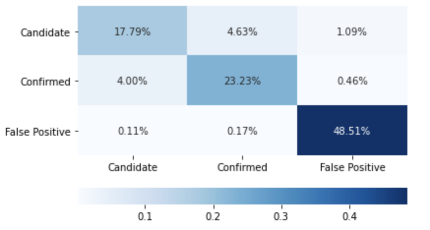
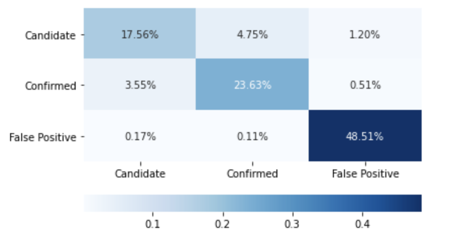
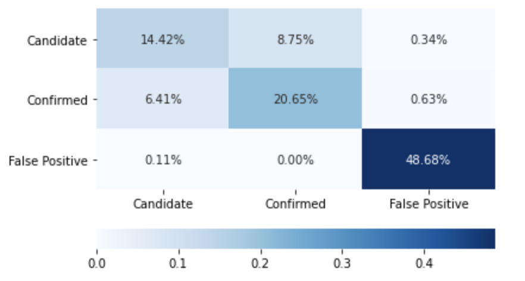
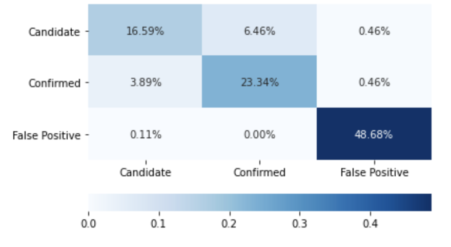

# machine-learning-challenge
**Machine Learning Homework:** This project focused on taking exoplanet measurement data & using machine learning libraries such as sklearn to create a model that will successfully predict an outcome with new data at a high success rate. If new measurements for another potential exoplanet were recorded, this model could predict whether or not it will be a confirmed planet, a candidate, or a false positive planet.

**models:**
- julia_brunett.sav: Best model created to predict new exoplanets

**resources:**
- exoplanet_data.csv: Original data file with exoplanet measurement data

***model_1.ipynb***
- Random Forest Classifier model

***model_2.ipynb***
- Logistic Regression Classifier model

 

# Overall Results Comparison:

# Best Model: Model 1 - Random Forest Classifier
- *Training Results:* 1.0
- *Testing Results:* 0.897
- **Summary:** This model is the best model, with a testing score of 0.897. This means that the model can predict an outcome correctly 89.7% of the time. This model would be good to predict which exoplanets are not true, as it has a pretty good success rate of predicting "False Positives".

## Before Tuning:

## After Tuning:

 

# Model 2 - Logistic Regression Classifier
- *Training Results:* 0.889
- *Testing Results:* 0.886
- **Summary:** This model has a testing score of 0.886, which is good, but not the best compared to the first model. This model could be improved by using GridSearch again to see if there are any other parameters that can be modified to produce better results. This model could correctly predict an exoplanet 88.6% of the time, which is pretty good.

## Before Tuning:

## After Tuning:

